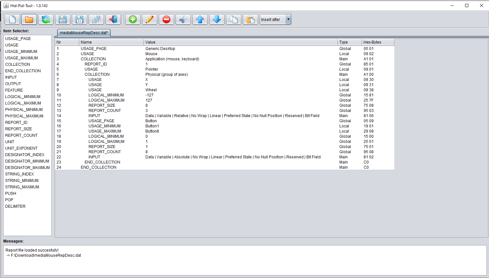

# HidPidTool
A modern tool to create, modify, develope and debug HID and PID report descriptors like used for USB or BT applications. 

## Content
- [Motivation](#motivation)
- [Limitation](#limitation)
- [Requirements](#requirements)
- [Import and Export](#import-and-export)
- [Data Handling and Recognition](#data-handling-and-recognition)
- [Shortcuts](#shortcuts)

## Motivation
Searching the web for a tool to create report descriptors for HID and PID usage leads me to the standard [Descriptor Tool](https://www.usb.org/document-library/hid-descriptor-tool) of the USB Foundation. After strugling around with bugs and missing features like "crashes to work-loss", "undefined gui elements", "uncomprehensible behaviour" and "cruel import/export" I searched the web for a modern tool with no success. Realizing that nobody seems to provide a viable tool to develope and debug report descriptors for HID or PID usage I decided to create my own tool. Here it is!

## Limitation
The tool is not capable of handling report descriptors with "long" type of entries (more then 4 data bytes). Only the "short" element type (id byte with upto 4 data bytes) is useable. New added report elements cannot be longer then this limit. When a descriptor file contains such long elements at read-in the tool will in most cases misinterprete or discard it.

## Requirements
The tool is compiled as .jar package for a java virtual machine with a least main version 11.

## Import and Export
- `.dat` intel lava data file
- `.h` c header file
- `.inc` assembler include file

The tool is capable of exporting the listed formats. The import function can at least read files with the listed formats from the "Descriptor Tool" and from itself. Variations of this formats from other sources are considered but not fully tested/supported.

## Data Handling and Recognition
The tool uses a construct of linked tables to decode meaning, usage and limitations to a human comprehensible display. The tables are formatted as tab-seperated-value files located in the `~/tables` subpath. In the case of new or unknown meanings (if the display shows "unkwown / reserved") the appropriate table file can be extended.

## Shortcuts
- `strg + c` copy the selected elements to clipboard
- `strg + v` paste clipboard elements to selected line
- `delete` removes the selected elements
- `double-click on element` opens the edit panel for the clicked element
- `double-click on item name` opens the adding panel for the clicked item

In addition the element table is a gridview so all copied data can be pasted to excel.
